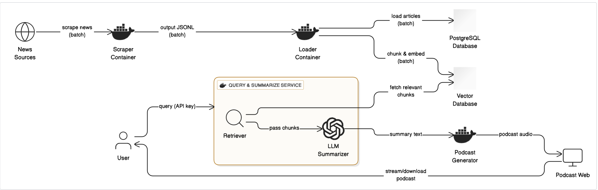

# TEST NewsJuice Prototype Pipeline (WIP for Milestone 2)

This repository contains the **NewsJuice Prototype Pipeline**, a containerized system for **scraping**, **processing**, **retrieving**, and **summarizing** news content.  

---

## ⚙️ Pipeline Overview

Here pict->



The pipeline consists of **four containers**, each responsible for a distinct stage of processing.  
Artifacts are exchanged via the `./artifacts` directory.  
A **PostgreSQL vector database** hosted on **Google Cloud SQL (GCS)** is used for storage.

### 📦 Containers

1. **🕸️ Scraper**  
   - Accesses the *Harvard Gazette* RSS feed  
   - Extracts the articles
   - Stores results in `news.jsonl` in the ./artifacts folder

2. **📥 Loader**  
   - Loads `news.jsonl` from ./artifacts folder
   - Performs **chunking & embedding**  
   - Adds chunks to the **vector database**  

3. **🔍 Retriever**  
   - Prompts the user for a **news briefing**  
   - Embeds the **news briefing**  
   - Retrieves top-2 relevant entries from the **vector database** and stores in `top-2.txt`

4. **📝 Summarizer** [NOT YET THERE]  
   - Reads `top-2.txt`
   - Calls an **LLM** to generate a **summary**  
   - Saves output to `summary.txt`  

---

## 🚀 Usage

The project provides both **one-line execution** and **step-by-step** container runs using `docker-compose` and `Makefile`.

### 🔧 One-line build & run options

**Option 1: Docker Compose**  
```bash
docker compose build \
 && docker compose up -d dbproxy \
 && docker compose run --rm scraper \
 && docker compose run --rm loader \
 && docker compose run --rm retriever \
 && docker compose run --rm summarizer
 ```

**Option 2: Makefile**

```bash
make run
```

### 🔧 Step-by-step execution:

```bash
docker compose build
docker compose up -d dbproxy
docker compose run --rm scaper
docker compose run --rm loader
docker compose run --rm retriever
docker compose run --rm summarizer
```

To stop all services:
```bash
docker compose down
```


Database Information

- **Account:** `harvardnewsjuice@gmail.com`  
- **Project:** `NewsJuice`  
- **Project ID:** `newsjuice-123456`
- **Instance:** `newsdb-instance`  
- **Region:** `us-central1`
- **Database:** `newsdb` (PostgreSQL 15)  
- **Table:** `chunks_vector`  


---

## Prerequisites

1. **Install Cloud SQL Proxy** (to connect to GCS database from local dev):

   ```bash
   brew install cloud-sql-proxy
   ```
   or install as part of Google Cloud SDK:

   ```bash
   brew install google-cloud-sdk
   ```

2. **Have the GCP Service Account key file** in `~/../secrects/sa-key.json`  (i.e. in a folder called secrets in the parent directory of `NewsJuice-Pipeline_MS_v2`.) The service account used: `newsjuice-proxy@newsjuice-123456.iam.gserviceaccount.com`


The SQL proxy is started in the docker-compose file and runs in the background. This opens a local port (`5432`) and connects securely to the Cloud SQL instance.


---

## License

This project is part of the **NewsJuice** prototype. All rights reserved.
