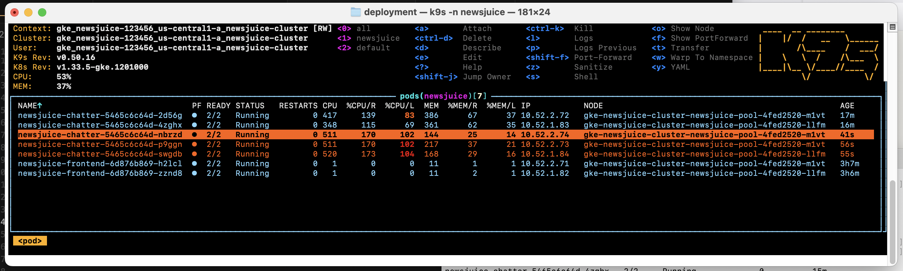

# Scaling Configuration for NewsJuice (kubernetes)

This document describes the scaling setup implemented for the NewsJuice application.

---

## 🔧 Scaling Strategy

| Type | Description |
|------|-------------|
| **Manual Horizontal Scaling** | 2 pods implemented (base configuration) |
| **Horizontal Pod Autoscaler (HPA)** | Scales pods based on CPU usage (configured via Pulumi) |
| **Cluster Autoscaler** | Scales nodes automatically (enabled by default in GKE) |

### HPA Parameters

| Parameter | Value |
|-----------|-------|
| `min_replicas` | 2 |
| `max_replicas` | 10 |
| `average_utilization` | 50% (CPU) |

### Implemented HPA Status
```bash
root@32cc13d7288e:/app# kubectl get hpa -n newsjuice
NAME                    REFERENCE                      TARGETS       MINPODS   MAXPODS   REPLICAS   AGE
newsjuice-chatter-hpa   Deployment/newsjuice-chatter   cpu: 1%/50%   2         10        2          45s
```

---

## 🧪 Load Testing Setup

To observe pod autoscaling in action, you'll need to install `hey` and `k9s` on your local machine.

### Prerequisites Installation

#### Install k9s (Kubernetes CLI UI)
```bash
brew install k9s
gcloud container clusters get-credentials newsjuice-cluster --zone=us-central1-a --project=newsjuice-123456
gcloud components install gke-gcloud-auth-plugin
```

#### Install hey (Load Testing Tool)
```bash
brew install hey
```

---

## 🚀 Running the Load Test

Run multiple terminals in parallel to observe different outputs. **Terminal 3 + 4 is sufficient for a demo.**

| Terminal | Purpose | Command |
|----------|---------|---------|
| Terminal 1 | Watch HPA | `kubectl get hpa -n newsjuice -w` |
| Terminal 2 | Watch pods | `kubectl get pods -n newsjuice -w` |
| Terminal 3 | Watch everything | `k9s -n newsjuice` |
| Terminal 4 | Generate load | `hey -z 120s -c 100 https://www.newsjuiceapp.com/api/health` |

### Load Test Parameters

| Flag | Value | Description |
|------|-------|-------------|
| `-z` | 120s | Duration of load test |
| `-c` | 100 | Number of concurrent users |

> **Note:** This test calls the health check endpoint of the chatter API. This endpoint must be excluded from middleware authentication (configured in `main.py` of chatter).

---

## 📊 Example Output (k9s)

<p align="center">
  
</p>
