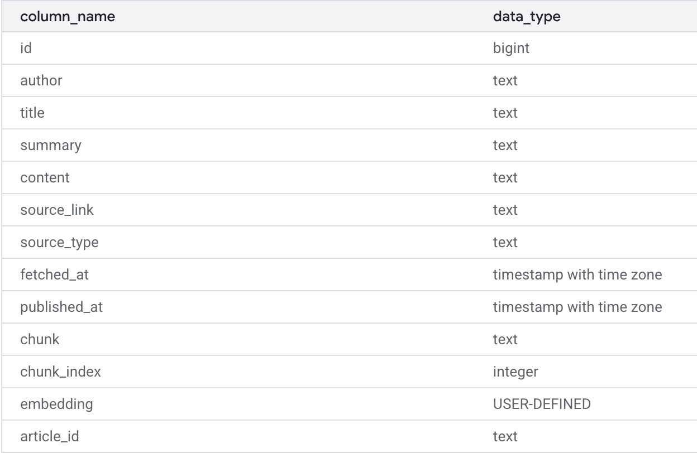

# Loader service  

- Reads news file from `./artifacts/news-jsonl`
- Does chunking of each article, with various chunking options
- Generates a unique article ID (with uuid)
- Embeds the chunks and creates an output file in `./artifacts/chunked_articles/`. Each article generates one jsonl file with each line being one chunk of the article. Within each article, each chunk gets a running `chunk_index` (starting from 0).
- Then uploads the chunks to the vector database

Uses Vertex AI for embeddings of the chunks

**Chunking option available**

- `char-split` character splitting
- `recursive-split` recursive splitting
- `semantic-split` (using embedding model below)

**Model used:** (for chunking and then for chunking embedding)
```bash
EMBEDDING_MODEL = "text-embedding-004"
EMBEDDING_DIM = 768 
```

**chunks_vector**: table where chunks are stored in vector database:



### Notes regarding chunks_vector table:

- `embedding`= VECTOR(768)
- `chunk_index`= starts from 0 and enumerates all chunks for one article

 